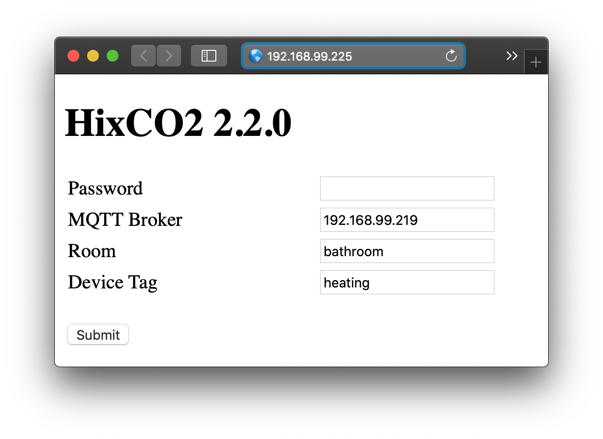

# HixCO2


**Current status: prototype**

A WIFI connected CO2 sensor based on the ESP8266 microcontroller and MH-Z19 CO2 sensor. A 128x64 I2C oled display also shows the current measurements. Its measurements are pubished via MQTT and in my home system are received via a raspberry pi running Mosquitoo, Nodered, InfluxDB and Grafana.
## Improvements

- [ ] Configuration of WIFI SSID/PWD via web interface
- [ ] Design a PCB and 3D printed enclosure


## MQTT

### Publishing


```
{room}
   └─── HixCO2
           └─── {deviceTag}
                     └─── device
                     │       └─── count
                     │       └─── room
                     │       └─── device_type
                     │       └─── device_version
                     │       └─── device_tag
                     │       └─── device_name
                     │       └─── wifi_ssid
                     │       └─── wifi_ip
                     │       
                     └─── status
                     │       └─── count
                     │       └─── wifi_rssi
                     │       └─── co2
                     │       └─── temperature
                     │
                     └─── influxdb
```

### Subscribing

This device does not subscribe to any topics

## Configuration web interface



* Once connectted to the WIFI a normal browser can be used to configure the MQTT details.
* Just go the the device's ip address with your browser
* Password is intitially set as `bornem1973`.
* At this moment the WIFI SSID and password are hardcoded in the src/secret.cpp file